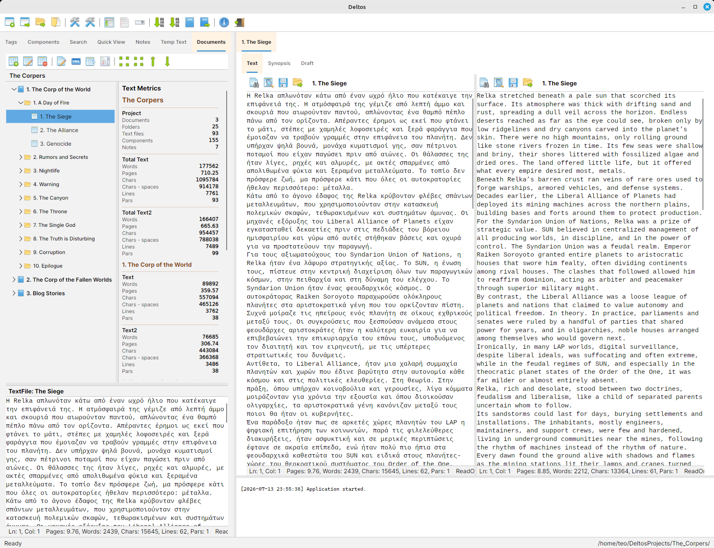
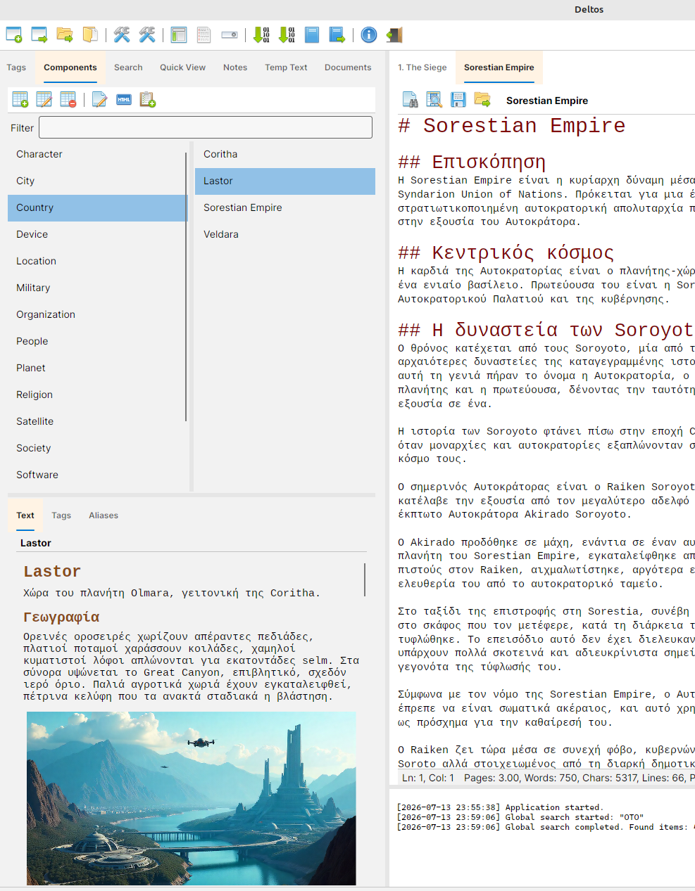
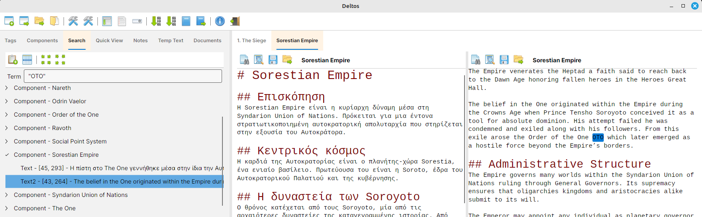
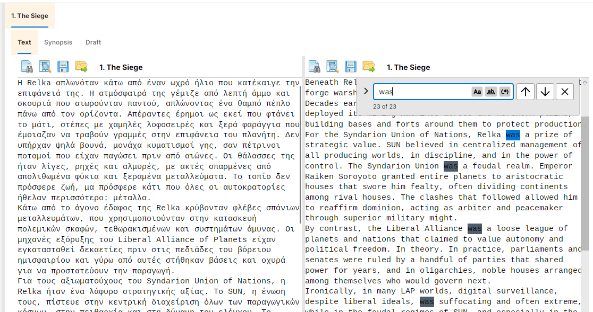
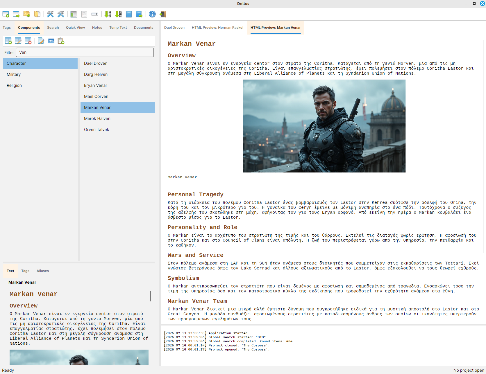
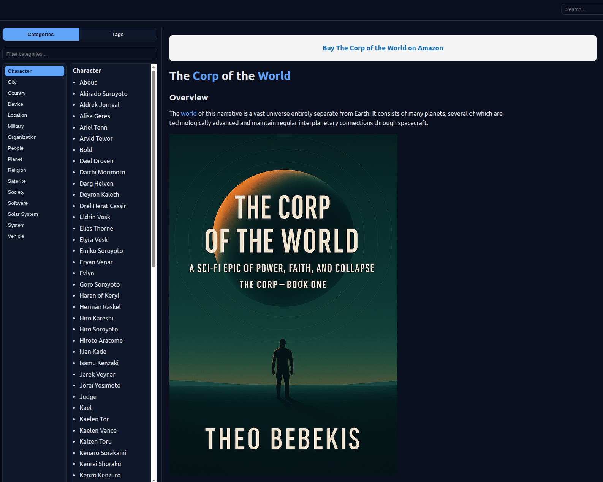
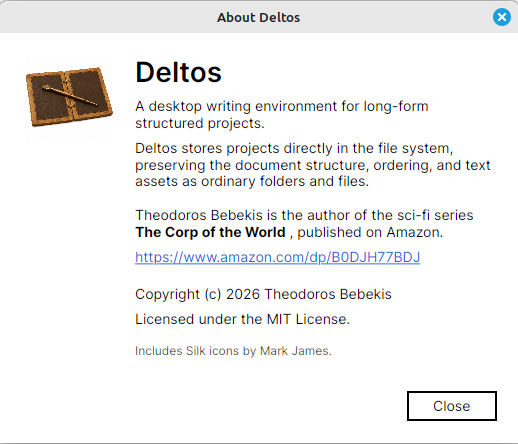

# Deltos

Deltos is a desktop writing environment for structured long-form projects.

It is designed for authors who need more than a plain text editor: novelists,
worldbuilders, essayists, technical writers, documentation authors, and anyone
working with large bodies of connected text.

Deltos can be used to write a novella, a novel, a multi-book series, a
technical manual, an essay collection, a knowledge base, or a documentation
project. Its core idea is simple: writing belongs in a calm editor, structure
belongs in a visible tree, and the project itself should remain readable as
ordinary files and folders.

>  Native desktop application for Windows, Linux, and macOS. <br>
>  Built with [Avalonia](https://avaloniaui.net/).



> Your writing remains yours, stored as ordinary Markdown files and folders.

## Status

Deltos is an early release and is actively developed.

The current version is already usable for real writing projects, but the
application is still evolving. The project storage format is plain files and
folders, yet users should keep normal backups, especially before moving,
renaming, exporting, or generating large project outputs.

## Features

- Project-based writing workspace.
- Sample project creation with ready-made flat, chapter, or part/chapter
  structure templates.
- Recent project list for quickly reopening workspaces.
- File-system-first storage with ordinary folders, markdown files, and JSON
  metadata.
- Multiple documents inside a single project.
- Two-language writing support with primary and secondary titles and text.
- Item titles are stored in `Info.json` as human-readable text. Storage folder
  names are generated from sanitized primary titles.
- Configurable document structure templates, such as Part, Chapter, Section,
  Scene.
- Documents and folders can contain an ordered mix of folders and text files.
- Folder and text-file organization with clear ordering and same-parent
  up/down movement.
- Change Parent support for moving folders and text files between document
  containers.
- Item output metadata for export behavior, including title visibility, page
  breaks, TOC inclusion, and numbering.
- Markdown editing with primary and secondary language text.
- Markdown tables are shown in HTML preview and exported as tables in HTML and
  ODT output.
- Project images can be referenced from markdown by file name, such as
  ``.
- Synopsis and draft text areas for documents, folders, and text files.
- Temp scratchpad.
- Notes list for project-level notes.
- Components for worldbuilding, reference material, characters, places,
  organizations, concepts, and technical entities.
- Component categories, tags, and aliases.
- Tag browser and component browser, with category and tag management.
- HTML preview for markdown content.
- Project-wide search across documents, text files, components, notes, and temp
  text.
- Whole-word project search using quoted terms, such as `"empire"`.
- Whole-word project search from the editor using Ctrl + left click on a word.
- Find and replace inside every text editor, with highlighted matches and
  next/previous navigation.
- Markdown bold and italic shortcuts using Ctrl + B and Ctrl + I.
- Quick View list for collecting important items and search hits while working.
- Text metrics for every editor.
- Built-in documentation available from the main toolbar.
- Theme selection with Default, Light, and Dark application themes.
- Auto-save support.
- Export per document to TXT, Markdown, HTML, and ODT.
- Internal Markdown export for writing one markdown file per text file with
  hierarchical file names.
- Plain-text export mode for prose that should not be treated as markdown.
- Git commit and push integration for project folders.
- Static wiki generation from components.
- Light, direct desktop UI built around sidebars, trees, tabs, and editors.

## What Is Deltos?

Deltos is a writing workspace, not a single-document editor.

A Deltos project can hold the manuscript, its supporting notes, the world or
domain reference material, temporary text, images, exports, and a generated
static wiki. The user can move between the structure of the work and the actual
text without leaving the application.

For fiction, Deltos can manage books, chapters, scenes, characters, places,
timelines, and worldbuilding notes.

For non-fiction, it can manage manuals, sections, essays, articles, reference
entries, terms, categories, tags, and documentation pages.

The same model works because Deltos does not force a specific literary shape.
The document structure is chosen by the user.

## Two-Language Writing

Deltos supports writing the same project in two languages.

Documents, folders, text files, and components have a primary title and a
secondary title. In storage and metadata these are named `Title` and `Title2`.
The primary title is used by default. The secondary title is used in
secondary-language editor headers, exports, and wiki output when it exists.

Text files and components also have primary and secondary text. The secondary
text can be shown beside the primary text in the editor, making it possible to
write, translate, or maintain parallel versions of the same material inside one
project.

## Core Concepts

### Project

A project is the root workspace.

It contains documents, components, notes, images, temp text, project settings,
and export/wiki configuration. A project is stored directly in a folder chosen
by the user.

### Document

A document is a major written work inside the project.

Examples:

- A novel.
- A novella.
- A short-story collection.
- A technical manual.
- A documentation volume.
- A long essay.

Each document may contain folders, text files, or both.

Each document has a primary title and an optional secondary-language title. The
primary title is used in the normal UI, while the secondary title is used for
secondary-language editor headers and exports when available.

A document can use a user-defined structure template. For example:

```text
Document
    Part
        Chapter
            Scene
```

or:

```text
Document
    Chapter
        Section
```

The structure is a creation aid for folder level names. It does not force text
files to live only at the last level. A document can contain text files
directly, and any folder can contain both folders and text files.

### Folder

A folder is a structural unit inside a document and is also a container.

Its display title may be `Part`, `Chapter`, `Section`, or any other level name
defined by the document structure. Folders may also have primary and secondary
titles plus synopsis text.

Folders can contain an ordered mix of folders and text files.

### TextFile

A text file is the actual writing unit.

It stores:

- Primary title.
- Secondary title.
- Primary text.
- Secondary language text.
- Synopsis.
- Draft.

Text files are markdown files on disk, but Deltos can also treat prose as plain
text during export when markdown interpretation is not desired.

### Component

A component is a project-level reference item.

Components are useful for:

- Characters.
- Places.
- Countries.
- Organizations.
- Machines.
- Religions.
- Events.
- Concepts.
- Glossary terms.
- Technical subjects.

Each component has primary and secondary titles, category, tags, aliases,
primary text, and secondary language text. Categories and tags are derived from
the components themselves, so there is no separate taxonomy database to
maintain.

Components can be exported as a static wiki.

### Notes

Notes are project-level text items for supporting material that does not belong
inside the document tree or the component library.

### Temp

Temp is a scratchpad for transient writing, fragments, reminders, and material
that has not yet found its place.

### Search

Search is a project navigation tool, not only a text lookup command.

Global Search scans the whole project and returns structured results grouped by
the item where each match was found. A result can point to a title, synopsis,
draft, primary text, secondary language text, note, component, or temp text.

Typing a plain term performs a contains search. Typing the term inside double
quotes performs a whole-word search:

```text
empire
"empire"
```

Opening a search result takes the user back to the real editor and highlights
the matching term in context. This keeps search connected to writing instead of
turning it into a separate report.

Each editor also has local find and replace. Local search highlights every
match, can move to the next or previous match, and can replace the current
match or all matches.

### Quick View

Quick View is a temporary working list.

It is useful when several items matter at the same time: a group of scenes, a
set of components, a few notes, or specific search results. Items can be added
from lists, tags, components, notes, and global search.

Quick View is saved with the project, so it can be used as a small research
desk or task tray for the current writing session.

## Typical Workflow

1. Create, open, or generate a sample project.
2. Create a document.
3. Choose the document structure.
4. Add folders and text files.
5. Write in the editor.
6. Add synopsis and draft material where useful.
7. Create components for reference material.
8. Categorize and tag components.
9. Preview markdown as HTML.
10. Use Global Search to move through the project.
11. Collect active items in Quick View.
12. Review text metrics.
13. Export a document to TXT, HTML, or ODT.
14. Generate a static wiki from components.
15. Commit and push the project with Git.

## Project Storage

Deltos stores a project as ordinary folders and files.

There is no opaque database file. The project folder contains readable
markdown, JSON metadata, images, resources, and generated output.

The item tree is derived from the file system. Ordering is encoded in folder
and file names using numeric prefixes. Human-readable titles are stored in each
item's `Info.json`.

Example:

```text
001._The_Corp_of_the_World
002._The_Corp_of_the_Fallen_Worlds
003._Blog_Stories
```

When Deltos reads an item from disk:

- The numeric prefix becomes the order index.
- The `Info.json` title becomes the display title.
- If an old item has no title in `Info.json`, Deltos falls back to the decoded
  folder name.

Each item has an `Info.json` file for metadata, including `Title` and `Title2`.
Titles are human-readable text and may contain characters that are not valid in
file or folder names.

Document storage uses `ProjectManifest.json` to identify the storage contract
version. Projects without a manifest are treated as legacy projects.

Storage folder names are generated from the primary title by sanitizing it for
the file system. If two primary titles produce the same sanitized storage name,
the second one is rejected. Deltos does not add automatic suffixes such as
`_2`.

Text content is stored in markdown files such as `Text.md`, `Text2.md`,
`Synopsis.md`, and `Draft.md`.

Project images are stored in the project `Images` folder. Markdown text can
reference those images by file name:

```md

```

Deltos resolves that path against the project `Images` folder for markdown
preview and document export. Existing project-relative image paths such as
`Images/diagram.png` and `../Images/diagram.png` are also supported.

Document and folder child items are stored in a common `Items` folder. The
child type is read from each child's `Info.json`.

Example:

```text
Document
    Items
        001._Preface
            Info.json
            Text.md
        002._Part_I
            Info.json
            Items
                001._Chapter_One
                    Info.json
                    Items
                        001._Opening_Scene
                            Info.json
                            Text.md
```

The numeric prefixes are storage order only. The UI shows item titles without
the numeric prefixes.

When a legacy project is opened, Deltos asks whether to convert it to the
current storage format. If the user agrees, Deltos first asks for an external
backup folder, creates a full backup copy of the old project there, and only
then saves the original project in the new format.

## Document Structure

Document structure is one of the central ideas of Deltos.

The user can choose a structure template when creating or configuring a
document. A novel might use parts, chapters, and scenes. A manual might use
chapters, sections, and topics. An essay collection might use only one level.

Deltos uses that structure as a suggested list of folder level names. It helps
the UI create folders with meaningful level titles, but it does not restrict
where text files may be placed.

This keeps large works navigable without forcing every document into one fixed
shape.

Example mixed document:

```text
Document
    Preface
    Introduction
    Part I
        What Is a Business Application?
        Types of Business Applications
            Type 1
            Type 2
    Back Matter
        Glossary
```

`Up` and `Down` reorder an item inside its current parent. To move an item to a
different document or folder container, use `Change Parent`.

## Item Metadata

Documents, folders, and text files have shared metadata.

Common metadata:

- Primary title.
- Secondary title.
- Include title in output.
- Page break before.
- Include in TOC.
- Numbering: `Automatic`, `None`, or `Custom`.
- Custom numbering text.

The Add/Edit item dialog edits this metadata. The item type is shown but cannot
be changed after creation.

The output metadata is persisted in `Info.json` and applied during document
export.

## Editing

The main workspace is tab-based.

Opening a text file, component, note, preview, or metrics page creates a tab in
the main content area. Tabs can be reordered. Text editors include status
information and text metrics.

The editor supports project-wide font settings and optional secondary language
visibility.

When the secondary language editor is visible, its header uses the secondary
title when available and falls back to the primary title. Ordered items keep the
same display numbering in both editor headers.

Text editing includes local find and replace. Matches are highlighted directly
inside the editor, and the user can move between them without leaving the text.

Editors support quick markdown formatting. Ctrl + B toggles bold text and
Ctrl + I toggles italic text for the current selection or the word at the
caret.

Images can be inserted with standard markdown syntax. When an image is in the
project `Images` folder, write only the image file name:

```md

```

The markdown preview resolves the image from the project images folder.

Global Search complements local editor search. It finds text across the whole
project, then opens the matching item in the main content area and highlights
the term in the correct editor.

Ctrl + left click on a word in an editor sends that word to Global Search as a
whole-word search.

## Shortcuts

- `Ctrl + S`: Save.
- `Ctrl + F`: Find and Replace.
- `F3`: Next match.
- `Shift + F3`: Previous match.
- `Esc`: Clear search highlights.
- `Ctrl + T`: Search for the word at the caret.
- `Ctrl + G`: Whole-word Global Search for the word at the caret.
- `Ctrl + Left Click`: Whole-word Global Search for the clicked word.
- `Ctrl + B`: Toggle bold.
- `Ctrl + I`: Toggle italic.
- `Ctrl + +`: Increase editor font size.
- `Ctrl + -`: Decrease editor font size.
- `Ctrl + 0`: Reset editor font size.

## Project Settings

Project settings are saved with each project and cover the parts that depend on
that project rather than on the application as a whole.

Git settings:

- Remote name.
- Branch.
- Remote URL.

Wiki settings:

- Primary wiki output folder.
- Secondary-language wiki output folder.
- Home component title.
- About component title.
- Tag page generation.
- Site base URL.
- Default social image URL.

Application settings cover local preferences such as recent projects, auto-save,
application theme, editor font settings, words-per-page page estimates, and
secondary-language editor visibility.

The application theme can be changed from the main toolbar or from Settings.
Default follows the operating system theme, while Light and Dark force that
theme immediately without restarting the application.

Built-in documentation is copied to the application data folder so it can be
opened from the main toolbar. The copied files are refreshed when the
application assembly is newer than the stored documentation copy.

## Export

Deltos exports documents, not the whole project.

Supported formats:

- TXT.
- Markdown.
- Internal Markdown.
- HTML.
- ODT.

The export dialog lets the user choose language, source material, output format,
title handling, and page-break behavior.

Language options:

- Primary text.
- Secondary text.

Source options:

- Text.
- Synopsis.

Title options:

- Folder title parts: bullet, number, word, and title.
- Text-file title parts: bullet, number, word, and title.

Output behavior:

- Exports are generated into an output folder and do not replace the source
  markdown files in the project.
- TXT exports produce plain text.
- Markdown exports preserve markdown text.
- Internal Markdown exports write one markdown file per text file, with file
  names that include the document, container, and text-file numbering.
- HTML exports produce browser-readable output.
- ODT exports produce a document file suitable for word processors.
- Markdown pipe tables are rendered as real tables in HTML and ODT exports when
  text files are treated as markdown.
- ODT table exports use relative table width so tables adapt when the word
  processor page size changes.
- HTML and ODT exports copy referenced project images into an export-local
  `Images` folder and rewrite generated HTML image paths to those copied files.
- `Image max width` limits exported image width while preserving image aspect
  ratio.
- Plain-text mode can be used for prose that should not be parsed as markdown.
  It is disabled by default.
- Page breaks are controlled by each item's metadata.
- Per-item `Include title in output` hides the exported title/heading while
  keeping the item's text.
- Per-item `Page break before` starts that item on a new page in HTML and ODT
  exports, and emits a page-break marker in Markdown and TXT exports.
- Per-item `Include in TOC` controls HTML table-of-contents entries for the
  item and markdown headings inside a text file.
- Per-item `Numbering` controls automatic, hidden, or custom numbering in
  exported item titles.

Export heading rules:

- The document title is used as the export file name and is not exported as a
  heading.
- Secondary-language exports use the secondary document title as the file name
  when one is available.
- Folder and text-file titles use the secondary title in secondary-language
  exports, falling back to the primary title when the secondary title is empty.
- Folder titles and text-file titles are exported as headings according to
  their level in the document tree.
- Markdown headings inside a text file are exported below the text-file title
  level. The highest heading level used in that text file becomes the first
  level below the text-file title. For example, inside a Heading 1 text file,
  `##` becomes Heading 2 and `###` becomes Heading 3.
- Markdown headings inside text files are still recognized when `Treat
  TextFiles as Plain Text` is enabled.
## Static Wiki

Deltos can generate a static wiki from project components.

The wiki includes:

- Component pages.
- Category navigation.
- Tag navigation.
- Search index.
- Theme support.
- Copied images and assets.
- Optional About page.

This is useful for worldbuilding, public reference material, documentation, or
project knowledge bases.

Wiki output is generated into the configured wiki folder. It is derived output,
not the canonical project source. The canonical data remains the project
components, images, and settings.

Deltos can build a primary wiki and a secondary-language wiki. The secondary
wiki uses secondary component text and titles when available.

## Git Integration

Deltos can run Git commit and push commands for the project folder.

Credentials are not handled by Deltos. The user configures Git normally on the
machine and in the repository. Deltos only provides convenient toolbar actions
and logs the command result.

## Screenshots

### Components



### Global Search



### Local Search



### Html Preview



### Static Wiki



### About




## Author

Deltos is created by Theodoros Bebekis.

Theodoros Bebekis is the author of the sci-fi series **The Corp of the World**,
published on Amazon.

https://www.amazon.com/dp/B0DJH77BDJ

## License

Deltos is licensed under the MIT License.

## Icons

Deltos uses icons from the Silk icon set 1.3.

Author: Mark James

Project: https://github.com/legacy-icons/famfamfam-silk

License: Creative Commons Attribution 2.5

License URL: http://creativecommons.org/licenses/by/2.5/
